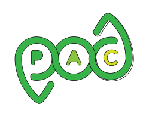

# PODPAC 

> Pipeline for Observation Data Processing Analysis and Collaboration

Data wrangling and processing of geospatial data should be seamless 
so that earth scientists can focus on science. 

The purpose of PODPAC is to facilitate:

 * Access of data products
 * Subsetting of data products
 * Projecting and interpolating data products
 * Combining/compositing data products
 * Analysis of data products
 * Sharing of algorithms and data products
 * Use of cloud computing architectures (AWS) for processing
 
## Installation

For installation instructions, see [install.md](doc/source/install.md). 

## Documentation

The official PODPAC documentation is available here: [https://podpac.org](https://podpac.org)

For usage examples, see the [podpac-examples](https://github.com/creare-com/podpac_examples) repository. 

## Contributing

You can find more information on contributing to PODPAC on the [Contributing page](https://podpac.org/contributing.html)

## Stability / Maturity

PODPAC is in a *beta* phase of development. As such:

* All development will adhere to a semantic versioning system
* Major revisions may contain backwards incompatible changes, but these changes will be documented in the [CHANGELOG](CHANGELOG.md)
* We are working to improve documentation, please contact us or create an issue if documentation is out of date or incorrect
* We look forward to receive feedback on usability and compatibility

## Acknowledgments

This material is based upon work supported by NASA under Contract No 80NSSC18C0061.

## References

For PODPAC references, see the [References page](https://podpac.org/references.html)
