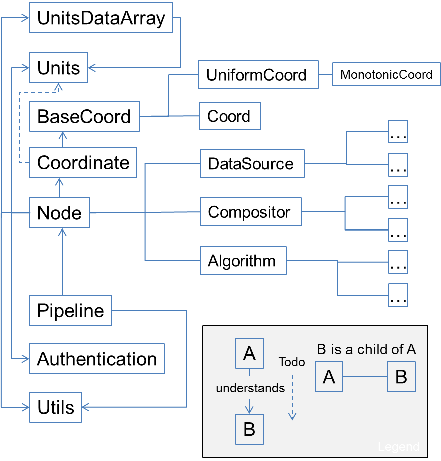

# Installation
See [Installation Notes](install.md)

# Code design

The essential class structure is captured in the following image:



The directory structure is as follows:

* `dist`: Contains installation instructions and environments for various deployments, including cloud deployment on AWS
* `doc`: Any documentation
* `html`: HTML pages used for demonstrations
* `podpac`: The PODPAC Python library
    * `core`: The core PODPAC functionality -- contains general implementation so of classes
    * `datalib`: Library of Nodes used to access specific data sources -- this is where the SMAP node is implemented (for example)
    * `alglib`: Library of specific algorithms that may be limited to particular scientific domains

# Contributing

To get a sense of where the project is going, have a look at our [Roadmap](roadmap.md)

There are a number of ways to contribute:

* Create new issues for feature requests or to report bugs
* Adding / correcting documentation
* Adding a new unit test
* Contributing a new node that accesses a specific datasource
* Contributing a new node that implements a domain-specific algorithm
* Commenting on issues to help out other users

To contribute:

* Fork the PODPAC repository on github
* Create a new feature branch from the `develop` branch

```bash
git checkout develop  # Assuming you've already checked out and tracked the develop branch
git branch feature/my_new_feature
```
* Make your changes / additions
* Add / modify the docstrings and other documentation
* Write any additional unit tests
* Create a new pull request

At this point we will review your changes, request modifications, and ultimately accept or reject your modifications. 

## Coding style

* Generally try to follow PEP8, but we're not strict about it. 
* Code should be compatible with both Python 2 and 3

### Lint

To help adhere to PEP8, we use the `pylint` module. This provides the most benefit if you [configure your text editor or IDE](https://pylint.readthedocs.io/en/latest/user_guide/ide-integration.html)  to run pylint as you develop. To use `pylint` from the command line:

```bash
$ pylint podpac                 # lint the whole module
$ pylint podpac/settings.py     # lint single file
```

Configuration options are specified in `.pylintrc`.

## Testing

We use `pytest` to run unit tests. To run tests, run from the root of the repository:

```
$ pytest
$ pytest -k "TestClass"    # run only the TestClass
```

Configuration options are specified in `setup.cfg`

## Code Coverage

We use `pytest-cov` to monitor code coverage of unit tests. To record coverage while running tests, run:

```bash
$ pytest --cov=podpac --cov-report html podpac   # outputs html coverage
```


# A Note on PODPAC's Governance Model

* We encourage and welcome contributions from the wider community
* Presently, a small group of core developers decide which contributions will be incorporated
    * This is a complex software library
    * Until the library is mature, the interfaces and features need tight control
    * Missing functionality for your project can be implemented as a 3rd party plugin
    * For now, we are trying to be disciplined to avoid feature creep. 
